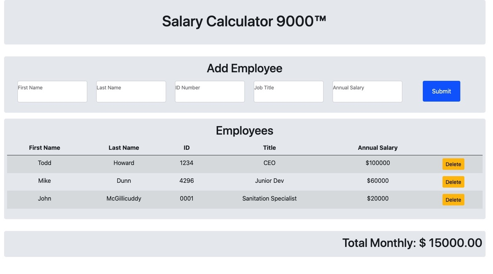

# Salary Calculator 9000

## Description

The Salary Calculator 9000 is an application that can be used to determine the total monthly cost of your companies payroll. Simply complete the input form by entering the employees information, and the app will display each employee in a convenient table right on the page. The app will also calculate your total monthly payroll cost, and alert you with an onscreen color change when it exceeds the approximate cost of a vintage Alfa Romeo.

In the unfortunte event you need to lay off one or more employees, just click the delete button in their row, and they will be removed from the table. Thier monthly payroll costs will also be deducted from your total monthly payroll cost.

Dissolving the company and liquidating your assets? Easy! Just refresh the page, and all your laborious data entry will be for naught!

## Screen Shot

## Built With

HTML 5, CSS 3, Javascript, jQuery 3.5, Bootstrap 5

## Acknowledgement
Thanks to [Prime Digital Academy](www.primeacademy.io) who equipped and helped me to make this application a reality.

## Support
If you have suggestions or issues, please email me at dunnmj42@gmail.com
